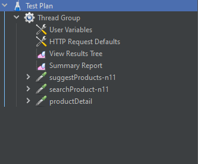

## __This project is a load test project developed for ```https://www.n11.com```__

# Introduction

- It is a load test for the behavior of the search module of the https://www.n11.com header and list the result after the search.
- It will only work for 1 user.

# Scenarios
- SuggestProducts - Type a word in search bar and see suggestions 
- SearchProduct - Search a word in search bar and see products list
- ProductDetail - Go to a product in product list.
<br>

## Requirements

- Java JDK 8 or higher version.
- ApacheJMeter

<br>

## Step 1


In this step, we'll clone the project and open the .jmx file in JMeter

#### Instructions

- First, clone the project:

```sh
git clone https://github.com/bekiraycibin/EbubekirAycibin.git
```
- Open **ApacheJMeter**

- Click on the  ```File``` > ```Open``` button located in the top left corner of JMeter

- After importing you should have a test plan named ```n11-loadTesting.jmx```
- Then you can run scenarios and see report values
<center>
<p align="center">

</p>
</center>

<br>

# Results

<center>

#### View Results Tree
<p align="center">

</p>

#### Summary Report
<p align="center">

</p>

</center>